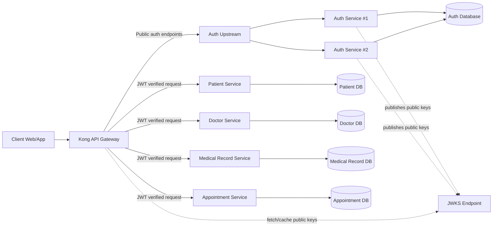
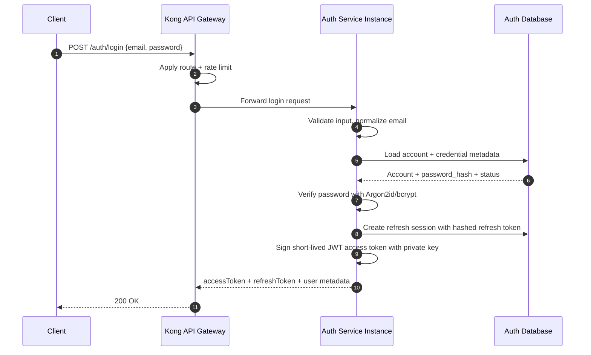
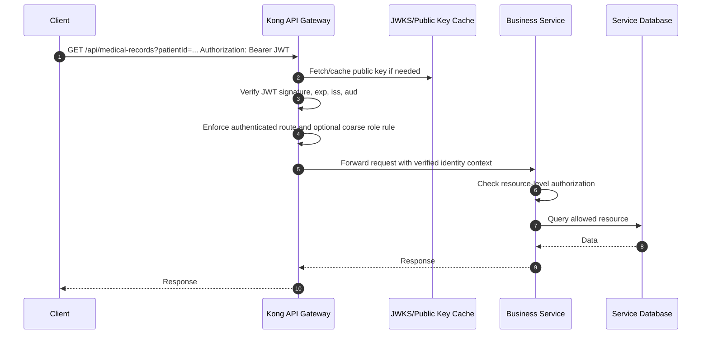
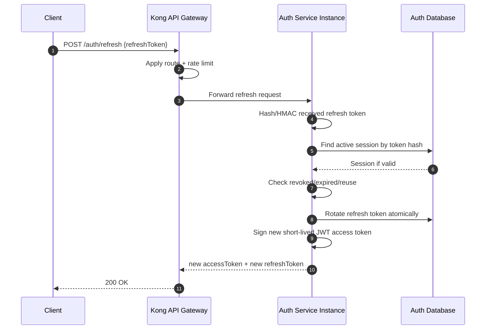
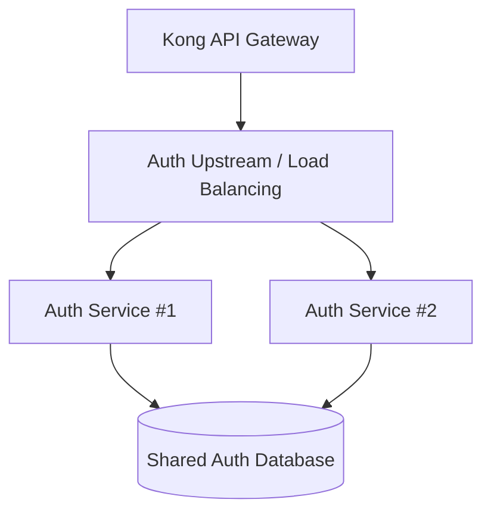
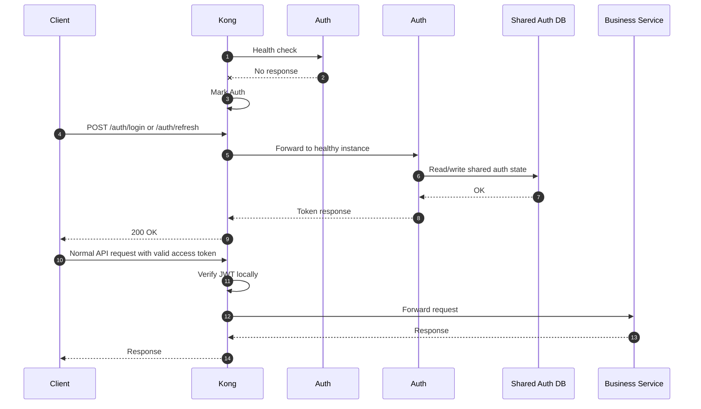

# Authentication Architecture

> Status: **DESIGN — pending approval**  
> Scope: Thiết kế Authentication Service cho hệ thống microservice maternal healthcare support system.  
> Không implement source code trong giai đoạn này.

---

## 1. Mục tiêu

Authentication Service cần cung cấp nền tảng xác thực an toàn cho hệ thống healthcare có dữ liệu người dùng và hồ sơ y tế nhạy cảm, nhưng vẫn phù hợp với quy mô repository hiện tại.

Mục tiêu chính:

- Authentication Service chịu trách nhiệm đăng nhập, xác thực credential, phát hành access token, refresh access token, logout và quản lý refresh token/session.
- Access token dùng JWT ngắn hạn, stateless.
- Normal authenticated request **không gọi Auth Service** để verify JWT.
- Kong API Gateway verify JWT locally trước khi forward request tới business services.
- Business services tự chịu trách nhiệm authorization nghiệp vụ/resource-level.
- Auth Service có thể chạy nhiều instance phía sau Kong/upstream load balancing, application-level stateless càng nhiều càng tốt.
- Refresh token/session state nằm trong shared persistent storage, không nằm trong memory từng Auth instance.
- Không over-engineer: chưa đưa Redis, Kafka, Kubernetes, Vault, Keycloak, service mesh, mTLS vào MUST HAVE nếu repository hiện tại chưa cần.

---

## 2. Current Architecture

### 2.1 Repository hiện tại

Các thành phần đã xác nhận từ source/config hiện tại:

- `docker-compose.yml`
  - Có `frontend`, `gateway`, `kong-database`, `kong-init`, `service-a`, `service-b`.
  - Kong Gateway dùng PostgreSQL riêng `kong-database` để lưu config.
  - Gateway expose proxy ở `localhost:8080`.
  - Kong Admin API và Kong Manager chỉ bind `127.0.0.1`.
  - `service-a` và `service-b` hiện vẫn expose port ra host: `${SERVICE_A_PORT:-5001}:5000`, `${SERVICE_B_PORT:-5002}:5000`.
  - Có block commented cho shared `db`, `redis`, `rabbitmq`, nhưng chưa active.

- `docs/api-specs/kong.yml`
  - Đang route:
    - `/api/service-a` -> `http://service-a:5000`
    - `/api/service-b` -> `http://service-b:5000`
  - Hiện chỉ có global CORS plugin.
  - Chưa có route tới Auth Service.
  - Chưa có JWT verification plugin.
  - Chưa có rate limiting plugin.

- `services/apps/auth-service`
  - Là NestJS app skeleton.
  - Hiện chỉ có `GET /` trả về `Hello World!`.
  - Chưa có login/register/refresh/logout implementation.
  - Chưa có database module/entity/migration.
  - Chưa có password hashing, JWT signing, refresh token/session management.

- `docs/api-specs/auth-service.yaml`
  - Đã mô tả contract mong muốn ở mức API:
    - `GET /health`
    - `POST /auth/register`
    - `POST /auth/login`
    - `POST /auth/refresh`
    - `POST /auth/logout`
    - `GET /auth/me`
  - Response đang có `accessToken`, `refreshToken`, `tokenType`, `expiresIn`, `user`.

- `services/package.json`
  - NestJS 11 monorepo-like structure.
  - Chưa có dependency liên quan JWT, password hashing, ORM/database.

### 2.2 Domain/security context từ docs

Theo `docs/xac-dinh-yeu-cau.md` và `docs/analysis-and-design.md`:

- Hệ thống phục vụ quản lý khám thai và chăm sóc thai phụ.
- Actor chính:
  - Patient / Thai phụ
  - Receptionist / Lễ tân
  - Doctor / Bác sĩ
  - Nurse hoặc Midwife / Y tá, hộ sinh
  - Admin
- Dữ liệu nhạy cảm gồm hồ sơ y tế, đơn thuốc, phác đồ điều trị, thông tin định danh bệnh nhân.
- Auth Service được xác định là Utility Service, chịu trách nhiệm tài khoản và RBAC.
- API Gateway chịu trách nhiệm routing và auth check tầng vào.
- Authorization có yêu cầu RBAC nhưng resource-level authorization vẫn phải do service nghiệp vụ kiểm tra, ví dụ Thai phụ chỉ xem hồ sơ của mình, Bác sĩ chỉ xem bệnh nhân được phân công.

### 2.3 Nhận định hiện trạng

Repository hiện đang ở giai đoạn khung/mẫu. Authentication architecture đã được mô tả sơ bộ trong `services/apps/auth-service/README.md`, nhưng source code và Kong config chưa implement đầy đủ.

Điểm quan trọng:

- Documentation hiện tại nói API Gateway verify JWT offline bằng public key, nhưng `docs/api-specs/kong.yml` chưa cấu hình JWT verification.
- `auth-service.yaml` mô tả API contract, nhưng source `auth-service` chưa implement.
- Business services mẫu chưa có authorization guard hoặc contract nhận identity từ Kong.
- Docker Compose hiện expose business services trực tiếp ra host, có thể cho phép client bypass Kong trong local/dev.

---

## 3. Target Architecture

### 3.1 Nguyên tắc thiết kế

- **Auth Service owns identity data**: account, credential metadata, roles/permissions nếu thuộc Auth domain, refresh sessions/tokens.
- **Database per service boundary**: service khác không query trực tiếp Auth Database.
- **Stateless access token**: JWT access token có lifetime ngắn, Kong verify locally.
- **Stateful refresh token**: refresh token/session được quản lý trong Auth Database.
- **Kong as enforcement point for authentication**: Kong verify JWT và reject request không hợp lệ trước khi forward.
- **Business service owns business authorization**: service nghiệp vụ kiểm tra resource-level permission.
- **No business logic in Kong**: Kong không quyết định Doctor có quyền đọc patient cụ thể nào hay không.
- **No per-request Auth Service verification**: tránh biến Auth Service thành bottleneck và single point of failure.
- **Minimal new technology**: ưu tiên NestJS + PostgreSQL + Kong hiện có. Chỉ thêm dependency trực tiếp cần cho auth/security.

### 3.2 Overall Architecture

Ghi chú:

- Diagram thể hiện target dài hạn vừa đủ. Repository hiện tại mới có service mẫu; các business service cụ thể đang ở mức thiết kế/tài liệu.
- Auth Database là database riêng của Auth Service, không phải Kong database.
- Kong database chỉ lưu Kong configuration.

---

## 4. Authentication Service Responsibilities

Authentication Service chịu trách nhiệm:

- Account registration nếu hệ thống cho phép self-registration.
- Login bằng credential.
- Password hashing và credential verification.
- Phát hành JWT access token.
- Phát hành và quản lý refresh token/session.
- Refresh access token.
- Refresh token rotation.
- Logout một session.
- Logout all sessions / revoke all devices nếu cần.
- Revoke session bởi Admin hoặc security event.
- Quản lý role/permission metadata nếu thuộc identity/auth domain.
- Cung cấp JWKS/public key endpoint cho Kong hoặc admin cấu hình Kong.
- Audit security events.

Authentication Service **không** chịu trách nhiệm:

- Verify JWT cho mọi normal API request.
- Quyết định quyền đọc/sửa hồ sơ y tế cụ thể.
- Lưu medical record, diagnosis, treatment plan, prescription.
- Chứa business logic của Patient/Doctor/Appointment/Medical Record Service.

---

## 5. Password Security Design

### 5.1 Password storage

Password tuyệt đối không lưu plaintext.

Target:

- Dùng password hashing algorithm chuyên dụng:
  - **Recommended MUST HAVE**: Argon2id.
  - Alternative acceptable: bcrypt nếu team muốn dependency phổ biến hơn trong Node/NestJS.
- Mỗi password có salt riêng do library sinh ra.
- Không tự implement cryptography.
- Lưu `password_hash`, không lưu password gốc.
- Hash string nên chứa metadata của algorithm/cost/salt nếu library hỗ trợ.

Đề xuất thực tế cho project:

- Dùng `argon2` package cho Node.js nếu build environment ổn định.
- Nếu gặp khó khăn native build trong môi trường học tập/Docker, có thể dùng `bcrypt`/`bcryptjs`, nhưng cần cân nhắc performance và security.

### 5.2 Password policy

MUST HAVE:

- Minimum length ít nhất 8 ký tự; nên 10-12 ký tự cho staff/admin.
- Không log password trong request body.
- Không trả lỗi quá chi tiết kiểu `email exists but password wrong` ở login.
- Validate input bằng DTO/class-validator hoặc mechanism tương đương.

SHOULD HAVE:

- Block password quá yếu/phổ biến.
- Password change endpoint yêu cầu nhập current password hoặc admin privileged flow.
- Revoke refresh sessions sau khi đổi password.

### 5.3 Brute-force/login spam protection

MUST HAVE ở mức vừa đủ:

- Rate limit `POST /auth/login` theo IP và/hoặc account identifier.
- Sau nhiều lần login fail liên tiếp, áp dụng temporary lock/cooldown ngắn.
- Audit login failure.
- Không log password.

Thiết kế không cần anti-fraud phức tạp. Có thể kết hợp:

- Kong rate limiting cho request rate theo IP.
- Auth Service account-based throttling để chống brute force vào một account từ nhiều IP.

---

## 6. Access Token Design

### 6.1 JWT access token

Access token nên là JWT stateless, short-lived.

Recommended lifetime:

- Patient: 15-30 phút.
- Staff/Admin: 10-15 phút.
- Default practical choice: **15 phút**.

Lý do:

- Giảm rủi ro nếu token bị lộ.
- Vẫn đủ tiện dụng khi có refresh token.
- Khi Auth Service down tạm thời, user đang có access token hợp lệ vẫn dùng hệ thống cho đến khi token hết hạn.

### 6.2 Required claims

JWT chỉ chứa identity/authorization metadata tối thiểu:

| Claim | Mục đích |
|---|---|
| `iss` | Issuer, ví dụ `maternal-healthcare-auth` |
| `aud` | Audience, ví dụ `maternal-healthcare-api` |
| `sub` | Stable account/user id |
| `jti` | Access token id, hỗ trợ trace/audit nếu cần |
| `iat` | Issued at |
| `exp` | Expiration |
| `role` hoặc `roles` | Role cấp cao: PATIENT, DOCTOR, NURSE, RECEPTIONIST, ADMIN |
| `permissions` | Optional, chỉ permission coarse-grained cần ở gateway/service |
| `session_id` | Optional, giúp trace session; không dùng để verify mỗi request tại Auth Service |

Không đưa vào JWT:

- Medical record.
- Diagnosis.
- Prescription.
- Treatment plan.
- Patient health information.
- Địa chỉ, CCCD, số điện thoại, ngày sinh nếu không cần thiết.
- Refresh token.
- Password/credential metadata.

### 6.3 Validation rules

Kong phải validate:

- Signature hợp lệ.
- `exp` chưa hết hạn.
- `iss` đúng.
- `aud` đúng.
- Algorithm đúng allowlist, không chấp nhận `none`.
- Key id `kid` nếu dùng JWKS.

Business service có thể tin request đã authenticated nếu request đi qua Kong, nhưng vẫn nên:

- Kiểm tra header identity do Kong forward hoặc verify token lại nội bộ nếu cần defense-in-depth.
- Không tin client-supplied identity header nếu service bị public bypass.

---

## 7. JWT Signing and JWKS

### 7.1 Asymmetric signing

Target nên dùng asymmetric signing:

- Auth Service giữ **private key** để sign JWT.
- Kong giữ hoặc fetch **public key** để verify JWT.
- Business services không cần private key.

Recommended algorithm:

- RS256 là lựa chọn phổ biến, dễ tích hợp với gateway.
- ES256 có key nhỏ hơn nhưng có thể phức tạp hơn tùy tooling.

MUST HAVE:

- Private key không commit vào repository.
- Private key lấy từ environment variable, Docker secret, mounted file local-dev, hoặc secret manager tương lai.
- Public key có thể cấu hình vào Kong hoặc expose qua JWKS endpoint.
- Có `kid` để chuẩn bị key rotation.

### 7.2 JWKS

Đề xuất có JWKS endpoint nếu Kong/plugin được chọn hỗ trợ tốt:

- Endpoint: `GET /.well-known/jwks.json` hoặc `GET /auth/.well-known/jwks.json`.
- Chỉ expose public keys.
- Cho phép Kong cache public key.
- Hỗ trợ key rotation bằng cách publish nhiều public keys trong giai đoạn chuyển tiếp.

Mức ưu tiên:

- MUST HAVE: asymmetric signing và không commit private key.
- SHOULD HAVE: JWKS endpoint + `kid` + documented key rotation.
- FUTURE OPTIONAL: Vault/KMS/HSM cho production nghiêm túc.

### 7.3 Key rotation tối thiểu

Quy trình rotation vừa đủ:

1. Sinh key pair mới ngoài repository.
2. Add public key mới vào JWKS với `kid` mới.
3. Auth Service bắt đầu sign token mới bằng private key mới.
4. Giữ public key cũ cho đến khi toàn bộ access token cũ hết hạn.
5. Remove public key cũ khỏi JWKS/Kong config.

---

## 8. Refresh Token and Session Design

### 8.1 Nguyên tắc

Access token stateless; refresh token stateful.

Refresh token phải được Auth Service quản lý trong shared persistent storage để nhiều Auth instances có thể xử lý login/refresh/logout.

### 8.2 Refresh token format

Recommended:

- Refresh token là random opaque token có entropy cao, không phải JWT.
- Sinh bằng cryptographically secure random generator.
- Token gửi cho client một lần.
- Database chỉ lưu **hash của refresh token**, không lưu plaintext.

Ví dụ lưu:

- `refresh_token_hash = SHA-256(refresh_token + server_pepper)` hoặc HMAC-SHA256 với secret server-side.
- `server_pepper`/HMAC secret không commit vào repository.

Không cần tự implement crypto phức tạp; dùng Node `crypto` standard library cho random bytes và HMAC/SHA-256 là đủ nếu implement cẩn thận.

### 8.3 Refresh token rotation

MUST HAVE:

- Mỗi lần gọi `/auth/refresh` thành công:
  - Validate refresh token hash.
  - Kiểm tra session chưa revoked và chưa expired.
  - Revoke/mark token cũ là used/rotated.
  - Phát hành access token mới.
  - Phát hành refresh token mới.
  - Lưu hash token mới.
- Nếu phát hiện refresh token đã bị reuse sau khi rotated:
  - Revoke toàn bộ session liên quan.
  - Audit event `refresh_token_reuse_detected`.
  - Trả 401/403.

### 8.4 Session management

Session là persistent record đại diện cho một login/device.

Data tối thiểu:

| Field | Mục đích |
|---|---|
| `id` | Session id |
| `account_id` | Account owner |
| `refresh_token_hash` | Hash của refresh token hiện tại |
| `created_at` | Thời điểm login |
| `expires_at` | Hết hạn tuyệt đối |
| `last_used_at` | Theo dõi activity |
| `revoked_at` | Null nếu còn active |
| `revoked_reason` | logout, reuse_detected, password_changed, admin_revoked |
| `user_agent_hash` | Optional, audit nhẹ |
| `ip_hash` hoặc `last_ip` | Optional, tùy privacy policy |

Recommended expiration:

- Patient: 7-30 ngày tùy UX.
- Staff/Admin: 1-7 ngày.
- Default practical choice: 7 ngày cho staff/admin, 14-30 ngày cho patient nếu cần tiện dụng.

MUST HAVE endpoint/behavior:

- Login tạo session mới.
- Refresh cập nhật session/token.
- Logout revoke current session.
- Logout all sessions revoke mọi session của account.
- Password change revoke refresh sessions cũ.

Không lưu session quan trọng trong memory từng Auth instance.

---

## 9. Login Flow

Login failure behavior:

- Trả lỗi chung `401 Invalid credentials`.
- Tăng login failure counter/throttle state.
- Audit `login_failure` không chứa password.
- Không tiết lộ account tồn tại hay không.

---

## 10. Normal Authenticated Request Flow

Quan trọng:

- Không có bước Kong gọi `Auth Service /verify` cho mỗi request.
- Nếu Auth Service down, request với access token còn hạn vẫn hoạt động.
- Business service vẫn kiểm tra nghiệp vụ: Doctor này có được đọc Patient này không, Patient này có phải owner không.

---

## 11. Refresh Flow

Atomicity requirement:

- Refresh rotation nên thực hiện trong transaction hoặc update có điều kiện để tránh race condition khi hai refresh request chạy đồng thời.
- Chỉ một request được rotate thành công; request còn lại bị coi là invalid/reuse tùy trạng thái.

---

## 12. Auth Service Scaling

### 12.1 Multi-instance target

Target:

- Auth Service instances không lưu session state trong RAM.
- Mọi state cần cho login/refresh/logout nằm trong Auth Database.
- Private signing key được cung cấp giống nhau cho các instances hiện active, hoặc instances biết active key hiện tại.
- Kong route `/auth/*` tới Auth upstream có nhiều targets.
- Health check để instance chết không nhận traffic.

### 12.2 State placement

| State | Nơi lưu target | Lý do |
|---|---|---|
| Password hash | Auth Database | Persistent, shared |
| Account status | Auth Database | Persistent, shared |
| Role/permission metadata | Auth Database hoặc dedicated authorization table trong Auth DB | Identity contract |
| Refresh session/token hash | Auth Database | Stateful, shared giữa instances |
| Login failure counters | Auth Database initially; Redis optional future | Không mất khi instance restart |
| JWT access token | Client only; verified stateless | Không lưu server-side |
| Private signing key | Environment/secret mount | Không commit vào repo |
| JWKS public keys | Auth endpoint/Kong config/cache | Public verification |

Không để trong memory từng Auth instance:

- Refresh token/session active state.
- Account lock state quan trọng.
- Role/permission source of truth.
- Revocation state cho refresh token.

---

## 13. Failure Behaviour

### 13.1 One Auth instance fails

### 13.2 All Auth instances fail

Expected behavior:

- Login: unavailable.
- Refresh: unavailable.
- Logout: unavailable hoặc delayed tùy client retry.
- Existing valid access token: vẫn dùng được cho normal API request cho đến khi hết hạn vì Kong verify locally.

Đây là lý do quan trọng để access token stateless và không verify qua Auth Service mỗi request.

### 13.3 Auth Database fails

Expected behavior:

- Login/refresh/logout không hoạt động vì cần Auth Database.
- Existing valid access token vẫn dùng được cho tới khi hết hạn.
- Cần alert/log lỗi database.

Không cần thiết kế HA database phức tạp trong phase đầu nếu Docker Compose local/dev, nhưng production nên có backup/restore và managed database/replication.

---

## 14. Authorization Design

### 14.1 Authentication vs Authorization

Authentication trả lời: user là ai và đã đăng nhập hợp lệ chưa.

Authorization trả lời: user đó được làm gì với resource cụ thể nào.

Target phân quyền:

- Kong:
  - Verify JWT.
  - Enforce route cần authenticated.
  - Có thể enforce coarse-grained role nếu route rõ ràng chỉ dành cho staff/admin.
- Auth Service:
  - Quản lý account, role, permission metadata.
  - Phát hành claim role/permission tối thiểu trong JWT.
- Business Service:
  - Kiểm tra resource-level authorization.
  - Ví dụ Patient chỉ xem record của chính mình.
  - Ví dụ Doctor chỉ xem Patient được phân công, có appointment/consultation liên quan hoặc theo rule nghiệp vụ của Doctor/Medical Record Service.

### 14.2 Role model đề xuất

Initial RBAC roles:

- `PATIENT`
- `RECEPTIONIST`
- `DOCTOR`
- `NURSE`
- `ADMIN`

Không mặc định:

- `DOCTOR = được xem mọi Patient`.
- `NURSE = được sửa mọi MedicalRecord`.
- `ADMIN = bỏ qua audit`.

Permission có thể coarse-grained:

- `appointment:read`
- `appointment:write`
- `patient:read:self`
- `patient:read:assigned`
- `medical_record:read:self`
- `medical_record:read:assigned`
- `medical_record:write:assigned`
- `user:manage`

Không cần policy engine phức tạp trong phase đầu.

---

## 15. Kong API Gateway Responsibilities

Kong nên chịu trách nhiệm:

- Routing.
- CORS.
- JWT verification cho protected routes.
- Authentication enforcement.
- Optional coarse route-level RBAC.
- Rate limiting ở edge.
- Health checks/load balancing tới Auth Service instances.
- Forward verified identity context tới downstream services.

Kong không nên chịu trách nhiệm:

- Xác thực password.
- Phát hành token.
- Refresh token rotation.
- Lưu session.
- Patient-specific/doctor-assignment authorization.
- Business rule healthcare.

### 15.1 Auth routes

Target routes:

| External route | Target | Auth required |
|---|---|---|
| `POST /auth/register` | Auth Service | Public hoặc restricted tùy nghiệp vụ |
| `POST /auth/login` | Auth Service | Public + rate limit |
| `POST /auth/refresh` | Auth Service | Public + refresh token required |
| `POST /auth/logout` | Auth Service | Refresh token hoặc access token + refresh token |
| `GET /auth/me` | Có thể Auth Service hoặc handled by service/gateway | Access token required |
| `GET /.well-known/jwks.json` | Auth Service | Public, only public keys |
| `/api/*` protected routes | Business Services | Access JWT required |

### 15.2 Kong plugin choice

Cần kiểm tra plugin phù hợp khi implement:

- Kong OSS có `jwt` plugin nhưng cách hoạt động với consumer/secret cần thiết kế kỹ, đặc biệt asymmetric/JWKS support tùy plugin/version.
- Nếu native Kong JWT plugin không phù hợp JWKS dynamic, có thể cấu hình public key theo consumer hoặc cân nhắc plugin hỗ trợ OIDC/JWKS nếu available.
- Không quyết định thêm OIDC/Keycloak chỉ để có JWKS nếu chưa cần.

Design target vẫn là: Kong verify JWT locally bằng public key, không gọi Auth Service `/verify` mỗi request.

---

## 16. Gateway Bypass Protection

Hiện tại `service-a` và `service-b` expose ports trực tiếp ra host trong `docker-compose.yml`. Điều này tiện cho development nhưng cho phép bypass Kong nếu áp dụng tương tự cho business services thật.

Target:

- Client chỉ gọi Kong exposed port.
- Business services chỉ expose trong Docker network, không publish host ports trong môi trường tích hợp/production-like.
- Chỉ Kong có public host port.
- Kong Admin API/Manager tiếp tục bind local-only hoặc không expose trong production.

Practical Docker Compose target:

- Giữ `ports` cho Kong.
- Business services dùng `expose: ["5000"]` hoặc chỉ nằm trong `app-network`, không map `host:container`.
- Nếu cần debug local, có thể bật port qua override file riêng không commit cho production-like config.

Không cần service mesh hoặc mTLS trong phase đầu.

Defense-in-depth SHOULD HAVE:

- Business services reject request thiếu internal header do Kong inject, ví dụ `X-Gateway-Verified: true`, nhưng không coi đây là security boundary mạnh nếu service public.
- Quan trọng nhất vẫn là network-level không expose service trực tiếp.

---

## 17. Security Logging and Audit

Authentication Service nên audit các event:

- `login_success`
- `login_failure`
- `logout`
- `logout_all_sessions`
- `refresh_success`
- `refresh_failure`
- `refresh_token_reuse_detected`
- `password_change`
- `password_reset_requested` nếu có forgot-password
- `password_reset_completed` nếu có
- `role_changed`
- `permission_changed`
- `session_revoked`
- `account_locked`
- `account_unlocked`

Log/audit nên chứa:

- `event_type`
- `account_id` nếu biết
- `session_id` nếu có
- timestamp
- request id/correlation id
- IP hoặc hash/masked IP tùy privacy policy
- user agent hash hoặc metadata tối thiểu
- outcome success/failure
- reason code không nhạy cảm

Không log:

- Password.
- Access token.
- Refresh token.
- Private key.
- Raw Authorization header.
- Medical data.
- Diagnosis/prescription/treatment details.

Trong phase đầu có thể log vào Auth Database table hoặc application log có masking. Khi Audit Log Service được implement, Auth Service có thể publish/forward audit events theo pattern chung của repository.

---

## 18. Rate Limiting

### 18.1 Kong-level rate limiting

MUST HAVE:

- Rate limit `POST /auth/login` theo IP.
- Rate limit `POST /auth/refresh` theo IP/client.
- Nếu có `forgot-password`, rate limit rất chặt theo IP và email.

Kong phù hợp để chặn traffic spam tại edge trước khi vào Auth Service.

### 18.2 Auth Service-level throttling

SHOULD HAVE/MUST HAVE cho login:

- Đếm login failure theo account identifier normalized.
- Temporary cooldown sau nhiều lần fail.
- Không lock vĩnh viễn tự động nếu không có admin unlock flow.
- Reset counter sau login thành công hoặc sau window nhất định.

Nếu chưa có Redis, có thể lưu trong Auth Database. Redis là Future Improvement nếu traffic cao và cần distributed high-performance counters.

---

## 19. MFA Evaluation

MFA là security improvement tốt nhưng không nên làm phức tạp Phase 1.

Đánh giá:

- Patient:
  - Không bắt buộc MFA ngay ở foundation phase để tránh giảm UX.
  - Có thể thêm MFA optional sau, đặc biệt khi xem/tải dữ liệu nhạy cảm hoặc đổi thông tin quan trọng.
- Doctor/Nurse/Receptionist/Admin:
  - Nên có MFA ở roadmap sau foundation.
  - Staff/admin có quyền truy cập hồ sơ y tế và thao tác nhạy cảm nên rủi ro cao hơn.

Recommendation:

- Phase đầu: chuẩn bị data model không cản trở MFA tương lai, nhưng chưa implement MFA.
- SHOULD HAVE: MFA cho Admin và staff.
- FUTURE OPTIONAL: MFA optional cho Patient, step-up authentication cho thao tác nhạy cảm.

---

## 20. Database Design

Authentication Service phải sở hữu Auth Database riêng.

Không lưu:

- MedicalRecord.
- Diagnosis.
- Prescription.
- TreatmentPlan.
- Dữ liệu thai kỳ chi tiết.

### 20.1 Proposed Auth Database tables

MUST HAVE tối thiểu:

#### `accounts`

| Field | Note |
|---|---|
| `id` | UUID/string stable id |
| `email` | Unique normalized email nếu dùng email login |
| `phone` | Optional nếu hệ thống cần phone login |
| `status` | ACTIVE, LOCKED, DISABLED, PENDING_VERIFICATION |
| `created_at` | Timestamp |
| `updated_at` | Timestamp |
| `last_login_at` | Optional |

#### `credentials`

| Field | Note |
|---|---|
| `account_id` | FK accounts |
| `password_hash` | Argon2id/bcrypt hash |
| `password_updated_at` | Timestamp |
| `failed_login_count` | Optional/cooldown support |
| `locked_until` | Optional temporary lock |

#### `roles`

| Field | Note |
|---|---|
| `id` | Role id |
| `code` | PATIENT, DOCTOR, NURSE, RECEPTIONIST, ADMIN |
| `description` | Human-readable |

#### `account_roles`

| Field | Note |
|---|---|
| `account_id` | FK accounts |
| `role_id` | FK roles |

#### `permissions` / `role_permissions`

Optional in early phase if only simple role claim is used. SHOULD HAVE once permission granularity is needed.

#### `auth_sessions`

| Field | Note |
|---|---|
| `id` | Session id |
| `account_id` | FK accounts |
| `refresh_token_hash` | Current token hash |
| `created_at` | Timestamp |
| `expires_at` | Absolute expiry |
| `last_used_at` | Timestamp |
| `revoked_at` | Null if active |
| `revoked_reason` | logout/reuse/password_changed/admin_revoked |
| `user_agent_hash` | Optional |
| `ip_hash` | Optional |

#### `auth_audit_logs`

Can be local table initially, or later replaced/forwarded to Audit Log Service.

| Field | Note |
|---|---|
| `id` | Log id |
| `event_type` | login_success, refresh_failure, etc. |
| `account_id` | Nullable |
| `session_id` | Nullable |
| `occurred_at` | Timestamp |
| `request_id` | Correlation id |
| `metadata` | Sanitized JSON |

### 20.2 Database technology

Repository already uses PostgreSQL for Kong. For Auth Database, PostgreSQL is a practical choice:

- Reliable relational constraints for accounts/sessions/roles.
- Good transaction support for refresh token rotation.
- Familiar in Docker Compose.
- No need to introduce a separate database technology.

Important: Auth Database must be separate logical DB/schema/service ownership from Kong database and other service databases.

---

## 21. Technology Selection

| Technology / Dependency | Needed now? | Reason |
|---|---:|---|
| NestJS | Yes, existing | Auth Service skeleton already NestJS. |
| PostgreSQL for Auth DB | MUST HAVE | Persistent shared identity/session state; transactions for refresh rotation. |
| ORM/database library | MUST HAVE when implementing | Needed to access Auth DB safely. Choose consistent project standard once selected. |
| Argon2id library | MUST HAVE preferred | Secure password hashing. bcrypt acceptable fallback. |
| JWT library | MUST HAVE | Sign access tokens and expose claims. |
| Kong JWT verification config/plugin | MUST HAVE | Gateway verifies JWT locally. |
| JWKS endpoint | SHOULD HAVE | Cleaner key distribution/rotation if Kong integration supports it. |
| Redis | FUTURE OPTIONAL | Useful for high-volume rate limiting/counters, not required initially. |
| Kafka/RabbitMQ | FUTURE OPTIONAL | Audit/event integration later; not needed for auth foundation. |
| Kubernetes | FUTURE OPTIONAL | Current repo uses Docker Compose; do not require K8s now. |
| Vault/KMS/HSM | FUTURE OPTIONAL | Better production key management, but too heavy for current phase. |
| Keycloak/OIDC server | FUTURE OPTIONAL | Powerful but significant complexity; not needed unless auth requirements grow. |
| Service mesh/mTLS | FUTURE OPTIONAL | Strong internal security but overkill for current Docker Compose setup. |

---

## 22. Current vs Target vs Required Change

| Concern | Current | Target | Required Change |
|---|---|---|---|
| Login | `auth-service` source chỉ trả `Hello World`; OpenAPI có `/auth/login` | Auth Service validate credential, audit, issue access + refresh token | Implement controller/service/DTO/repository cho `/auth/login`; add password verification; add audit |
| Password storage | Chưa có DB/credential implementation | Password hash bằng Argon2id/bcrypt với salt, không plaintext | Add Auth DB tables `accounts`, `credentials`; add hashing dependency; không log password |
| Access token | OpenAPI có `accessToken`; chưa implement | Short-lived JWT signed asymmetric, minimal claims, exp/iss/aud | Add JWT signing, key config, claims contract, token lifetime config |
| Refresh token | OpenAPI có `/auth/refresh`; chưa implement | Opaque refresh token, stored hashed, rotation, revoke/reuse detection | Add `auth_sessions`; implement rotation transaction; logout/revoke behavior |
| JWT validation | Kong config chưa có JWT plugin | Kong verify JWT locally bằng public key/JWKS, không gọi Auth Service mỗi request | Configure Kong protected routes + JWT verification; decide plugin/JWKS integration |
| Kong | Routes only service-a/service-b; CORS only | Routes Auth + business services, CORS, JWT verification, rate limiting, health checks | Update `docs/api-specs/kong.yml` in implementation phase; add auth upstream/routes/plugins |
| Authorization | Docs nói RBAC; source chưa có guards/policy | RBAC coarse-grained + business service resource-level authorization | Define role/permission claims; implement service-level guards/checks in each business service later |
| Auth Service scaling | Docker Compose chưa chạy Auth Service; source app listens default 3000 | Multiple stateless Auth instances behind Kong, shared Auth DB | Add auth-service to compose, use consistent port, add health check, upstream load balancing |
| Session storage | Chưa có session | Persistent `auth_sessions` in Auth DB, no memory state | Add session schema/repository; no in-memory session map |
| Database | Kong PostgreSQL exists; no Auth DB | Auth Service owns separate Auth DB/schema; others cannot query it | Add Auth DB service/schema/migrations in implementation phase |
| Logging | Chưa có auth audit logging | Audit auth/security events without secrets/medical data | Add structured logging/audit table; mask sensitive fields |
| Rate limiting | Kong has no rate limit plugin | Kong edge rate limit + Auth Service account throttling | Add Kong rate limit plugin for auth endpoints; add DB-backed failure counters/cooldown |

---

## 23. Security Classification

### 23.1 MUST HAVE

Những thứ cần có để Auth Service đủ an toàn:

- Password không lưu plaintext.
- Password hashing bằng Argon2id hoặc bcrypt với salt.
- Không tự implement password hashing/crypto phức tạp.
- Không log password/token/private key.
- Short-lived JWT access token.
- JWT có `exp`, `iss`, `aud`, `sub`, role/permission tối thiểu.
- Asymmetric signing hoặc ít nhất không share symmetric secret rộng rãi; target recommended RS256.
- Private key/secret không commit vào repo.
- Kong verify JWT locally cho protected API routes.
- Không gọi Auth Service `/verify` mỗi normal request.
- Refresh token stateful, lưu hash, có expiration.
- Refresh token rotation.
- Logout revoke session.
- Session state lưu trong Auth Database, không trong memory instance.
- Auth Database riêng thuộc Auth Service.
- Business service tự làm resource-level authorization.
- Rate limit login/refresh ở mức cơ bản.
- Audit login success/failure, refresh failure, logout, revoke.
- Không expose business services trực tiếp trong production-like setup.

### 23.2 SHOULD HAVE

Nên có nhưng có thể làm sau foundation:

- JWKS endpoint với `kid` và key rotation documented.
- Logout all devices.
- Refresh token reuse detection revoke session family.
- Permission table ngoài role cơ bản.
- MFA cho Admin/Doctor/Nurse/Receptionist.
- Account temporary lock/cooldown theo account identifier.
- Password change revoke sessions.
- Structured audit logs có correlation id.
- Gateway inject verified identity headers và business services chỉ accept từ internal network.
- Docker Compose health checks cho Auth instances.
- Separate local override cho direct service ports khi debug.

### 23.3 FUTURE / OPTIONAL

Chỉ cần khi scale/production nghiêm túc hơn:

- Redis cho distributed rate limiting/counters/session cache.
- Vault/KMS/HSM cho key/secret management.
- Managed PostgreSQL HA/read replica/automated PITR.
- Keycloak/OIDC provider nếu cần federation, SSO, complex identity lifecycle.
- Service mesh/mTLS cho east-west traffic.
- SIEM integration.
- Advanced anomaly detection/fraud detection.
- Step-up authentication cho thao tác cực nhạy cảm.
- Token binding/device binding nâng cao.

---

## 24. Implementation Roadmap

> Roadmap này để developer/coding agent khác implement sau khi architecture được approve. Không implement trong task hiện tại.

### Phase 1 — Authentication foundation

Mục tiêu:

- Biến `auth-service` từ skeleton thành service có module structure cơ bản.
- Thêm Auth Database và account/credential schema.
- Implement register/login tối thiểu an toàn.

Files/modules bị ảnh hưởng dự kiến:

- `services/apps/auth-service/src/*`
- Auth module/controller/service/DTO/repository mới.
- Database config/migration folder nếu project chọn migration tool.
- `docker-compose.yml` để add Auth DB/Auth Service khi implement.

Database changes:

- Add `accounts`.
- Add `credentials`.
- Seed roles cơ bản nếu cần.

Infrastructure changes:

- Add Auth Database service/schema.
- Add environment variables cho DB connection.

Dependencies:

- Password hashing library: `argon2` preferred hoặc bcrypt fallback.
- Validation library nếu chưa có.
- ORM/database client theo convention được chọn.

Verify:

- Unit test password hashing/verification.
- Login success/failure test.
- Ensure password not returned/logged.
- `npm run test` cho auth-related tests.

### Phase 2 — Access JWT signing

Mục tiêu:

- Phát hành short-lived JWT access token với claims tối thiểu.
- Cấu hình private/public key ngoài repository.

Files/modules:

- Auth token service.
- Config module/env validation.
- Tests cho JWT claims/lifetime.

Database changes:

- Không bắt buộc.

Infrastructure changes:

- Add env vars hoặc mounted files cho private/public key local-dev.
- Document cách generate key pair không commit secret.

Dependencies:

- JWT library compatible NestJS/Node.

Verify:

- Token có `iss`, `aud`, `sub`, `exp`, `iat`, `role`.
- Token không chứa medical/personal data không cần thiết.
- Signature verify được bằng public key.

### Phase 3 — Refresh Token & Session

Mục tiêu:

- Implement refresh token opaque, hashed storage, session lifecycle.
- Implement refresh rotation, logout, logout all sessions.

Files/modules:

- Session entity/table/repository.
- Refresh endpoint/controller/service.
- Logout endpoint.

Database changes:

- Add `auth_sessions`.
- Optional `auth_audit_logs` nếu chưa có.

Infrastructure changes:

- Không thêm technology mới.

Dependencies:

- Node `crypto` hoặc equivalent standard crypto.

Verify:

- Refresh token plaintext không lưu DB.
- Refresh thành công rotate token.
- Token cũ không refresh lại được.
- Logout revoke session.
- Concurrent refresh test chỉ một request thành công.

### Phase 4 — Kong JWT Validation

Mục tiêu:

- Kong route Auth endpoints và protected business endpoints.
- Kong verify JWT locally, không gọi Auth Service mỗi request.
- Add rate limiting cho auth endpoints.

Files/modules:

- `docs/api-specs/kong.yml` trong implementation phase.
- Gateway/Kong docs nếu được yêu cầu.

Database changes:

- Kong database sẽ nhận config qua import/migration/admin API tùy workflow.

Infrastructure changes:

- Add Auth Service target/upstream in Docker Compose/Kong.
- Configure JWT plugin/public key/JWKS integration.
- Add rate limiting plugin.

Dependencies:

- Không nhất thiết thêm app dependency.
- Có thể cần Kong plugin configuration phù hợp.

Verify:

- Request không token vào protected route bị 401.
- Request token invalid/expired bị 401.
- Request token valid được forward.
- Auth Service down nhưng valid access token vẫn vào business route được.

### Phase 5 — Authorization foundation

Mục tiêu:

- Chuẩn hóa role/permission claim.
- Implement coarse-grained guards ở business services.
- Resource-level authorization nằm trong service nghiệp vụ.

Files/modules:

- Business service auth guard/interceptor/middleware.
- Shared contract chỉ nếu thực sự cần và được nhiều service dùng.
- Auth role/permission management modules.

Database changes:

- Add `roles`, `account_roles`.
- Add `permissions`, `role_permissions` nếu cần.

Infrastructure changes:

- Không bắt buộc.

Dependencies:

- Không thêm policy engine phase đầu.

Verify:

- Patient không xem được resource patient khác.
- Doctor chỉ xem assigned/related patient theo business rule.
- Admin route yêu cầu admin role.

### Phase 6 — Auth Service Replication

Mục tiêu:

- Chạy nhiều Auth Service instances phía sau Kong.
- Đảm bảo state shared qua Auth Database.

Files/modules:

- `docker-compose.yml` hoặc compose override.
- Kong upstream config.
- Health endpoint in auth-service.

Database changes:

- Không bắt buộc ngoài schema đã có.

Infrastructure changes:

- Add multiple Auth targets.
- Add health checks.
- Ensure instances share same signing key config and DB.

Dependencies:

- Không cần Kubernetes.

Verify:

- Stop Auth #1, login/refresh qua Auth #2 vẫn thành công.
- Existing access token vẫn gọi API khi một/toàn bộ Auth instances down.
- Session created by Auth #1 refresh được bởi Auth #2.

### Phase 7 — Security Hardening

Mục tiêu:

- Hoàn thiện audit, throttling, key rotation, MFA roadmap.

Files/modules:

- Audit logging module.
- Account lock/throttle module.
- JWKS/key rotation support.
- MFA module later.

Database changes:

- Add/extend `auth_audit_logs`.
- Add MFA tables later if implemented.

Infrastructure changes:

- Optional Redis if rate limiting DB becomes bottleneck.
- Optional secret manager in production.

Dependencies:

- MFA library/provider only when implementing MFA.
- Avoid adding heavy identity provider unless requirements justify.

Verify:

- Audit logs do not contain secrets.
- Rate limit works for login spam.
- Key rotation accepts old valid tokens until expiry and new tokens with new key.
- MFA staff/admin flow if implemented.

---

## 25. Consistency Notes and Open Decisions

### Confirmed from current code/config

- Auth Service exists but is skeleton only.
- Kong exists with database-backed config and CORS plugin only.
- Auth OpenAPI spec exists.
- Docker Compose currently uses Kong and service samples.
- Business service ports are currently exposed to host for samples.

### Documentation likely ahead of implementation

- `services/apps/auth-service/README.md` describes JWT offline verification and multiple Auth instances conceptually, but implementation/config does not yet realize it.
- `docs/api-specs/auth-service.yaml` describes auth endpoints that are not implemented in source.

### Decisions to approve before implementation

1. Use Argon2id or bcrypt for password hashing.
2. Use RS256 asymmetric JWT signing as target.
3. Use JWKS endpoint now or configure static public key in Kong first.
4. Choose Auth Database integration/ORM/migration approach for NestJS.
5. Decide whether self-registration is public for Patient only, while staff/admin accounts are admin-created.
6. Decide exact token lifetimes for Patient vs staff/admin.
7. Decide how strict gateway bypass prevention should be in local development vs production-like compose.

---

## 26. Final Design Recommendation

Recommended target for first implementation wave:

- Build Auth Service on existing NestJS skeleton.
- Add dedicated PostgreSQL Auth Database.
- Store password with Argon2id hash.
- Issue RS256 short-lived JWT access token with minimal claims.
- Store opaque refresh token hash in `auth_sessions` and rotate on refresh.
- Configure Kong to verify access JWT locally for protected routes.
- Keep Auth Service out of normal API request path.
- Keep resource-level authorization in business services.
- Do not add Redis/Kafka/Kubernetes/Vault/Keycloak/service mesh in MUST HAVE phase.
- Add those only when project scale/security requirements justify them.

This design satisfies the key failure requirement: if Auth Service is temporarily unavailable, users with valid access tokens can still access protected business APIs through Kong until token expiration.
