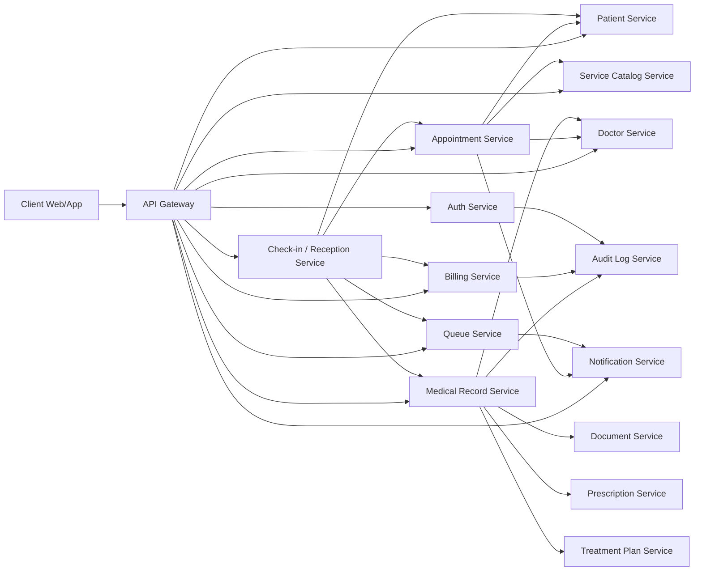

# Quy hoạch Microservices cho Use Case Thai phụ khám thai

> Mục tiêu: Xác định các services và thực thể chính từ use case `Thai phụ khám thai`.  
> Nguyên tắc: Giữ thiết kế đơn giản, dễ đọc, dễ nghiên cứu, nhưng vẫn đủ nền tảng để mở rộng hệ thống sau này.

---

## 1. Use case được phân tích

Nguồn chính:

- `docs/use-case-flow-thai-phu-kham-thai.md`

Use case mô tả quy trình tổng quát:

1. Thai phụ đăng ký tài khoản.
2. Thai phụ đăng nhập.
3. Thai phụ chọn hình thức khám:
   - Khám thường.
   - Khám dịch vụ.
4. Hệ thống ghi nhận lịch khám.
5. Hệ thống trả số thứ tự ưu tiên và thời gian ước tính.
6. Hệ thống gửi thông báo nhắc lịch.
7. Thai phụ đến bệnh viện.
8. Lễ tân xác nhận định danh.
9. Lễ tân xử lý nhập khám, cấp hồ sơ, thanh toán.
10. Hệ thống đưa thai phụ vào hàng chờ khám.
11. Y tá/điều dưỡng gọi bệnh nhân tiếp theo.
12. Bác sĩ khám lâm sàng.
13. Bác sĩ tổng hợp kết quả xét nghiệm/siêu âm.
14. Bác sĩ chẩn đoán, kê đơn, lập phác đồ điều trị.
15. Y tá/điều dưỡng scan hồ sơ và gửi lên hệ thống.
16. Hồ sơ được luân chuyển giữa các phòng khám/dịch vụ.
17. Quy trình khám hoàn tất.

---

## 2. Định hướng thiết kế đúng với hệ thống

Hệ thống này là hệ thống **đơn giản hóa quy trình khám cho thai phụ**, không phải hệ thống quản lý nhân sự bệnh viện.

Vì vậy, không nên thiết kế một service quá rộng kiểu `Staff Service` để quản lý toàn bộ bác sĩ, y tá, lễ tân như một hệ thống HR.

Cách nhìn phù hợp hơn:

- Bác sĩ cần được quản lý vì thai phụ có thể chọn bác sĩ, hệ thống cần biết lịch khám và chuyên khoa.
- Lễ tân là người thực hiện nghiệp vụ tiếp nhận tại quầy, nhưng thứ cần quản lý chính là **quy trình check-in/nhập khám**, không phải hồ sơ nhân sự lễ tân.
- Y tá/điều dưỡng là người thao tác trong hàng chờ và hồ sơ khám, nhưng ban đầu không cần một service riêng để quản lý y tá.
- Thai phụ là trung tâm của hệ thống, nên các service xoay quanh hành trình của thai phụ: đặt lịch, check-in, vào hàng chờ, khám, nhận hồ sơ, thanh toán, nhận thông báo.

---

## 3. Nguyên tắc chia service

Khi quy hoạch microservice, không nên tạo quá nhiều service quá sớm.

Nguyên tắc sử dụng trong tài liệu này:

- Mỗi service sở hữu một nhóm nghiệp vụ rõ ràng.
- Mỗi service phục vụ trực tiếp hoặc gián tiếp cho quy trình khám của thai phụ.
- Mỗi service sở hữu database của chính nó trong tương lai.
- Service khác không truy cập trực tiếp database của nhau.
- Không tách service chỉ vì một màn hình UI có nhiều bước.
- Không tạo `Staff Service` theo hướng quản lý nhân sự bệnh viện nếu scope chưa yêu cầu.
- Không đưa business logic vào API Gateway.
- Các service nên đủ độc lập để sau này scale hoặc phát triển riêng.
- Giai đoạn đầu có thể implement đơn giản, nhưng boundary nên rõ từ đầu.

---

## 4. Danh sách service đề xuất

### Tổng quan ngắn gọn

| # | Service | Vai trò chính | Mức cần thiết |
|---|---|---|---|
| 1 | Auth Service | Đăng ký, đăng nhập, token, vai trò người dùng | Bắt buộc |
| 2 | Patient Service | Hồ sơ thai phụ, thông tin định danh, thông tin thai kỳ cơ bản | Bắt buộc |
| 3 | Doctor Service | Bác sĩ, chuyên khoa, lịch khám, khả năng nhận lịch | Bắt buộc |
| 4 | Service Catalog Service | Danh mục dịch vụ khám, loại khám, phòng/dịch vụ | Nên có |
| 5 | Appointment Service | Đặt lịch, đổi/hủy lịch, trạng thái lịch khám | Bắt buộc |
| 6 | Check-in / Reception Service | Tiếp nhận thai phụ tại quầy, xác nhận định danh, nhập khám | Bắt buộc |
| 7 | Queue Service | Số thứ tự, hàng chờ, gọi bệnh nhân, trễ giờ | Bắt buộc |
| 8 | Medical Record Service | Hồ sơ khám, kết quả khám, xét nghiệm, siêu âm | Bắt buộc |
| 9 | Billing Service | Hóa đơn, thanh toán tạm ứng/bổ sung | Bắt buộc |
| 10 | Notification Service | Nhắc lịch, thông báo gọi số, cảnh báo | Bắt buộc |
| 11 | Document Service | File scan, tài liệu đính kèm | Có thể gộp ban đầu |
| 12 | Prescription Service | Đơn thuốc | Có thể gộp ban đầu |
| 13 | Treatment Plan Service | Phác đồ điều trị | Có thể gộp ban đầu |
| 14 | Audit Log Service | Nhật ký thao tác dữ liệu nhạy cảm | Nên có |
| 15 | API Gateway | Routing, xác thực đầu vào, CORS, rate limit | Bắt buộc |

---

## 5. Vai trò người dùng trong hệ thống

Các role người dùng nên thuộc `Auth Service`.

| Role | Ý nghĩa | Có cần service quản lý riêng ngay không? |
|---|---|---|
| PATIENT | Thai phụ sử dụng hệ thống | Có, thông tin nghiệp vụ thuộc Patient Service |
| DOCTOR | Bác sĩ khám/chẩn đoán/kê đơn | Có, thông tin phục vụ đặt lịch thuộc Doctor Service |
| NURSE | Y tá/điều dưỡng thao tác hàng chờ, nhập chỉ số, scan hồ sơ | Chưa cần service riêng |
| RECEPTIONIST | Lễ tân tiếp nhận, xác nhận định danh, nhập khám | Chưa cần service quản lý nhân sự riêng; nghiệp vụ thuộc Check-in Service |
| ADMIN | Quản trị hệ thống | Chưa cần service riêng trong use case này |

Điểm quan trọng:

- `Auth Service` biết user có role gì.
- `Doctor Service` quản lý bác sĩ vì bác sĩ là một phần của nghiệp vụ đặt lịch khám.
- `Check-in / Reception Service` quản lý quy trình lễ tân tiếp nhận bệnh nhân, không quản lý nhân sự lễ tân theo kiểu HR.
- Y tá không cần `Nurse Service` riêng ở giai đoạn đầu; y tá thao tác trên `Queue Service`, `Medical Record Service`, `Document Service` theo quyền được cấp.

---

## 6. Chi tiết từng service

## 6.1 Auth Service

### Trách nhiệm

- Đăng ký tài khoản.
- Đăng nhập.
- Phát hành access token / refresh token.
- Đăng xuất.
- Quản lý vai trò cơ bản:
  - Patient.
  - Doctor.
  - Nurse.
  - Receptionist.
  - Admin.

### Thực thể chính

- Account.
- Credential.
- Role.
- Permission.
- RefreshSession.

### Không nên làm

- Không lưu hồ sơ y tế.
- Không xử lý logic đặt lịch.
- Không xử lý nghiệp vụ check-in tại quầy.
- Không quyết định bác sĩ/y tá/lễ tân có được thao tác trên một hồ sơ cụ thể hay không; việc này thuộc service nghiệp vụ tương ứng.

---

## 6.2 Patient Service

### Trách nhiệm

- Quản lý hồ sơ thai phụ.
- Lưu thông tin định danh.
- Lưu thông tin liên hệ.
- Lưu thông tin thai kỳ cơ bản phục vụ đặt lịch và khám.

### Thực thể chính

- Patient.
- PatientIdentity.
- EmergencyContact.
- PregnancyProfile.

### Ví dụ dữ liệu

- Họ tên.
- Ngày sinh.
- Số điện thoại.
- Địa chỉ.
- Tuần thai hiện tại.
- Tiền sử bệnh cơ bản.

### Ghi chú

Patient Service chỉ quản lý hồ sơ định danh và thông tin nền của thai phụ. Kết quả khám chi tiết nên thuộc Medical Record Service.

---

## 6.3 Doctor Service

### Trách nhiệm

Doctor Service không phải hệ thống quản lý nhân sự bệnh viện. Service này chỉ quản lý thông tin bác sĩ cần thiết cho quy trình khám của thai phụ.

Trách nhiệm chính:

- Quản lý hồ sơ bác sĩ ở mức phục vụ khám.
- Quản lý chuyên khoa/chuyên môn của bác sĩ.
- Quản lý lịch khám/lịch nhận bệnh.
- Cung cấp danh sách bác sĩ cho khám dịch vụ.
- Cung cấp ngày giờ còn trống của bác sĩ.
- Cập nhật trạng thái bác sĩ có thể nhận lịch hay nghỉ đột xuất.

### Thực thể chính

- Doctor.
- DoctorProfile.
- Specialty.
- DoctorSchedule.
- DoctorAvailability.

### Ví dụ nghiệp vụ

- Thai phụ chọn bác sĩ khi đặt khám dịch vụ.
- Appointment Service kiểm tra bác sĩ còn slot hay không.
- Hệ thống xử lý trường hợp bác sĩ nghỉ đột xuất.
- Medical Record Service ghi nhận bác sĩ nào khám/chẩn đoán/kê đơn.

### Không nên làm

- Không quản lý chấm công/HR.
- Không quản lý toàn bộ nhân sự bệnh viện.
- Không quản lý nghiệp vụ lễ tân tiếp nhận bệnh nhân.
- Không quản lý hàng chờ.

---

## 6.4 Service Catalog Service

### Trách nhiệm

- Quản lý danh mục dịch vụ khám.
- Quản lý loại khám:
  - Khám thường.
  - Khám dịch vụ.
- Quản lý phòng khám/phòng dịch vụ ở mức phục vụ luồng khám.
- Quản lý giá cơ bản nếu chưa muốn tách pricing riêng.

### Thực thể chính

- MedicalService.
- ServiceCategory.
- Department.
- Room.
- BasePrice.

### Ví dụ nghiệp vụ

- Thai phụ chọn dịch vụ khám.
- Hệ thống hiển thị danh sách dịch vụ khám.
- Dịch vụ khám liên kết với chuyên khoa hoặc bác sĩ phù hợp.

### Ghi chú

Nếu muốn đơn giản hơn ở giai đoạn đầu, có thể gộp tạm danh mục dịch vụ vào Appointment Service. Tuy nhiên về lâu dài nên tách riêng để Appointment Service không bị phình to.

---

## 6.5 Appointment Service

### Trách nhiệm

- Quản lý lịch hẹn khám.
- Tạo lịch hẹn khám thường.
- Tạo lịch hẹn khám dịch vụ.
- Đổi lịch, hủy lịch.
- Quản lý trạng thái lịch hẹn.
- Kiểm tra slot khám còn trống ở mức đặt lịch.

### Thực thể chính

- Appointment.
- AppointmentSlot.
- SlotHold.
- AppointmentStatusHistory.

### Trạng thái gợi ý

- DRAFT.
- BOOKED.
- CHECKED_IN.
- CANCELLED.
- COMPLETED.
- NO_SHOW.

### Ví dụ nghiệp vụ

- Thai phụ chọn ngày khám thường.
- Thai phụ chọn bác sĩ và giờ khám dịch vụ.
- Hệ thống ghi nhận lịch khám.
- Bác sĩ nghỉ đột xuất thì tìm các lịch liên quan để xử lý.

### Không nên làm

- Không quản lý chi tiết hàng chờ.
- Không quản lý hồ sơ y tế.
- Không xử lý toàn bộ nghiệp vụ lễ tân tại quầy nếu đã có Check-in Service.

---

## 6.6 Check-in / Reception Service

### Trách nhiệm

Service này quản lý nghiệp vụ tiếp nhận thai phụ tại quầy. Đây là phần riêng so với đặt lịch và cũng khác với quản lý bác sĩ.

Trách nhiệm chính:

- Lễ tân tra cứu lịch hẹn của thai phụ.
- Lễ tân xác nhận định danh thai phụ.
- Xử lý trường hợp thai phụ đến đúng giờ, đến trễ, hủy tại quầy hoặc không tìm thấy lịch hẹn.
- Xác nhận thai phụ đã hoàn tất thủ tục nhập khám.
- Điều phối tạo hồ sơ khám ban đầu.
- Điều phối thanh toán phí khám cơ bản.
- Kích hoạt việc đưa thai phụ vào hàng chờ.

### Thực thể chính

- CheckIn.
- ReceptionCase.
- IdentityVerification.
- Admission.
- AdmissionStatusHistory.

### Ví dụ nghiệp vụ

- Thai phụ đến quầy lễ tân.
- Lễ tân xác nhận đúng người.
- Lễ tân xử lý nhập khám.
- Hệ thống mở hồ sơ khám rỗng.
- Hệ thống tạo hóa đơn tạm ứng/phí khám cơ bản.
- Sau khi thủ tục hoàn tất, hệ thống sinh QueueTicket.

### Không nên làm

- Không quản lý nhân sự lễ tân theo kiểu HR.
- Không tự lưu hồ sơ thai phụ thay Patient Service.
- Không tự lưu hồ sơ y tế chi tiết thay Medical Record Service.
- Không tự quản lý hàng chờ thay Queue Service.
- Không tự quản lý hóa đơn thay Billing Service.

### Ghi chú đơn giản hóa

Nếu MVP muốn rất đơn giản, có thể để Appointment Service xử lý endpoint `check-in`. Tuy nhiên vẫn nên ghi nhận rõ boundary `Check-in / Reception` để sau này tách ra dễ dàng khi nghiệp vụ tại quầy phức tạp hơn.

---

## 6.7 Queue Service

### Trách nhiệm

- Sinh số thứ tự.
- Quản lý hàng chờ khám.
- Tính thời gian chờ ước tính.
- Hiển thị danh sách chờ cho y tá/điều dưỡng.
- Cho phép y tá/điều dưỡng gọi bệnh nhân tiếp theo.
- Xử lý trường hợp đến trễ quá 30 phút.
- Quản lý ưu tiên khám thường/khám dịch vụ.

### Thực thể chính

- Queue.
- QueueTicket.
- QueuePriorityRule.
- QueueStatusHistory.

### Trạng thái gợi ý

- WAITING.
- CALLED.
- SERVING.
- DONE.
- SKIPPED.
- CANCELLED.

### Ví dụ nghiệp vụ

- Sau khi lễ tân nhập khám xong, hệ thống sinh QueueTicket.
- Thai phụ khám dịch vụ có thể có mức ưu tiên cao hơn.
- Thai phụ đến trễ hơn 30 phút bị mất quyền ưu tiên.
- Y tá gọi người tiếp theo vào khám.

### Ghi chú

Y tá không cần service riêng để gọi số. Y tá là role được Auth Service cấp quyền, còn nghiệp vụ gọi số thuộc Queue Service.

---

## 6.8 Medical Record Service

### Trách nhiệm

- Quản lý hồ sơ khám.
- Ghi nhận chỉ số ban đầu do y tá nhập.
- Ghi nhận kết quả khám lâm sàng.
- Ghi nhận kết quả xét nghiệm/siêu âm.
- Quản lý hồ sơ con theo phòng ban/dịch vụ.
- Tổng hợp kết quả cuối cùng cho bác sĩ.
- Lưu chẩn đoán ở mức hồ sơ khám.

### Thực thể chính

- MedicalRecord.
- ClinicalNote.
- VitalSign.
- LabResult.
- UltrasoundResult.
- Diagnosis.
- MedicalRecordVersion.

### Ví dụ nghiệp vụ

- Check-in Service yêu cầu tạo hồ sơ khám rỗng khi nhập khám.
- Y tá nhập cân nặng, huyết áp, chỉ số ban đầu.
- Phòng xét nghiệm cập nhật kết quả.
- Phòng siêu âm cập nhật kết quả.
- Bác sĩ xem toàn bộ kết quả để chẩn đoán.

### Ghi chú

Đây là service rất nhạy cảm vì chứa dữ liệu y tế. Cần phân quyền kỹ và audit đầy đủ.

---

## 6.9 Billing Service

### Trách nhiệm

- Quản lý hóa đơn.
- Ghi nhận phí khám cơ bản lúc nhập khám.
- Tạo hóa đơn bổ sung sau khám nếu có phát sinh.
- Cập nhật trạng thái thanh toán.
- Hỗ trợ hoàn tiền hoặc hủy hóa đơn nếu bệnh nhân hủy.

### Thực thể chính

- Invoice.
- InvoiceItem.
- Payment.
- PaymentTransaction.
- Refund.

### Ví dụ nghiệp vụ

- Lễ tân thu phí khám cơ bản.
- Hệ thống tạo Invoice loại ADVANCE.
- Sau khám, hệ thống tổng hợp dịch vụ thêm/thuốc thành Invoice loại SUPPLEMENTARY.
- Lễ tân xác nhận đã thanh toán.

### Ghi chú

Billing nên là service riêng vì nghiệp vụ tiền bạc thường thay đổi độc lập và cần audit rõ ràng.

---

## 6.10 Notification Service

### Trách nhiệm

- Gửi thông báo nhắc lịch hẹn.
- Gửi thông báo khi được gọi vào khám.
- Gửi thông báo khi lịch thay đổi.
- Gửi thông báo khi bác sĩ nghỉ hoặc cần điều phối lại.

### Thực thể chính

- Notification.
- NotificationTemplate.
- NotificationRecipient.
- DeliveryAttempt.
- NotificationPreference.

### Kênh gửi có thể mở rộng

- In-app notification.
- Email.
- SMS.
- Push notification.

### Ghi chú

Giai đoạn đầu chỉ cần lưu notification và giả lập gửi. Sau này có thể thêm SMS/email/push provider.

---

## 6.11 Document Service

### Trách nhiệm

- Quản lý file scan hồ sơ.
- Quản lý tài liệu đính kèm.
- Lưu metadata file.
- Cung cấp link tải/xem file theo quyền.

### Thực thể chính

- ScannedDocument.
- Attachment.
- DocumentMetadata.
- StorageObject.

### Ghi chú đơn giản hóa

Giai đoạn đầu có thể gộp document metadata vào Medical Record Service để giảm số service. Khi upload/file scan nhiều hơn, tách Document Service sẽ hợp lý hơn.

---

## 6.12 Prescription Service

### Trách nhiệm

- Quản lý đơn thuốc.
- Lưu danh sách thuốc, liều dùng, hướng dẫn sử dụng.
- Gắn đơn thuốc với hồ sơ khám hoặc lượt khám.

### Thực thể chính

- Prescription.
- PrescriptionItem.
- Medication.
- DosageInstruction.

### Ghi chú đơn giản hóa

Giai đoạn đầu có thể gộp Prescription vào Medical Record Service. Khi cần quản lý danh mục thuốc, kho thuốc hoặc kiểm tra tương tác thuốc thì tách service riêng.

---

## 6.13 Treatment Plan Service

### Trách nhiệm

- Quản lý phác đồ điều trị/chăm sóc thai kỳ.
- Theo dõi kế hoạch tái khám.
- Theo dõi kế hoạch chăm sóc theo từng giai đoạn thai kỳ.

### Thực thể chính

- TreatmentPlan.
- TreatmentPlanItem.
- FollowUpSchedule.
- CareInstruction.

### Ghi chú đơn giản hóa

Giai đoạn đầu có thể gộp Treatment Plan vào Medical Record Service. Nên tách riêng khi phác đồ trở nên dài hạn, có nhiều lần cập nhật hoặc có workflow riêng.

---

## 6.14 Audit Log Service

### Trách nhiệm

- Ghi lại thao tác quan trọng trên dữ liệu nhạy cảm.
- Ghi lại ai làm gì, lúc nào, trên tài nguyên nào.
- Hỗ trợ tra cứu lịch sử thay đổi.

### Thực thể chính

- AuditLog.
- AuditEvent.

### Sự kiện nên audit

- Đăng nhập/đăng xuất.
- Tạo/sửa/xem hồ sơ y tế.
- Kê đơn thuốc.
- Cập nhật phác đồ điều trị.
- Cập nhật hóa đơn/thanh toán.
- Cấp/thu hồi quyền.

### Ghi chú

Vì hệ thống có dữ liệu y tế nhạy cảm, audit là quan trọng. Tuy nhiên giai đoạn đầu có thể implement đơn giản bằng log table trước, sau đó tách Audit Log Service riêng.

---

## 6.15 API Gateway

### Trách nhiệm

- Là entry point duy nhất cho client.
- Routing request tới service phù hợp.
- Xác thực JWT/access token ở tầng gateway.
- CORS.
- Rate limiting cơ bản.

### Không nên làm

- Không xử lý nghiệp vụ đặt lịch.
- Không xử lý nghiệp vụ khám bệnh.
- Không xử lý nghiệp vụ tiếp nhận bệnh nhân tại quầy.
- Không xử lý quyền chi tiết kiểu bác sĩ A có được xem hồ sơ bệnh nhân B hay không.

---

## 7. Nhóm service theo mức ưu tiên triển khai

Để dễ nghiên cứu và triển khai, có thể chia thành 3 nhóm.

### 7.1 Nhóm lõi bắt buộc cho use case

Các service cần có để chạy được luồng Thai phụ khám thai từ đầu đến cuối:

| Service | Lý do |
|---|---|
| Auth Service | Người dùng cần đăng ký/đăng nhập và có role |
| Patient Service | Cần hồ sơ thai phụ |
| Doctor Service | Cần bác sĩ, chuyên khoa, lịch khám |
| Appointment Service | Cần đặt lịch khám |
| Check-in / Reception Service | Cần tiếp nhận thai phụ tại quầy và nhập khám |
| Queue Service | Cần số thứ tự và hàng chờ |
| Medical Record Service | Cần ghi nhận kết quả khám |
| Billing Service | Cần thu phí khám và hóa đơn |
| Notification Service | Cần nhắc lịch và gọi số |
| API Gateway | Cần entry point và xác thực request |

### 7.2 Nhóm nên có để mở rộng tốt

| Service | Lý do |
|---|---|
| Service Catalog Service | Quản lý danh mục dịch vụ khám/phòng ban rõ ràng |
| Document Service | Quản lý file scan/tài liệu tốt hơn |
| Audit Log Service | Cần cho hệ thống có dữ liệu y tế nhạy cảm |

### 7.3 Nhóm có thể tách sau

| Service | Có thể gộp ban đầu vào | Khi nào nên tách |
|---|---|---|
| Prescription Service | Medical Record Service | Khi cần quản lý thuốc, kho thuốc, kiểm tra tương tác thuốc |
| Treatment Plan Service | Medical Record Service | Khi phác đồ dài hạn, nhiều lần cập nhật, workflow riêng |
| Reporting Service | Các service nghiệp vụ hoặc dashboard đơn giản | Khi cần báo cáo quản trị phức tạp |
| Consultation Service | Chưa thuộc luồng khám trực tiếp này | Khi mở rộng chat/diễn đàn/chatbot |

---

## 8. Mapping bước trong use case sang service

| Bước | Hành động | Service chính | Service liên quan |
|---|---|---|---|
| 1 | Thai phụ đăng ký tài khoản | Auth Service | Patient Service |
| 2 | Thai phụ đăng nhập | Auth Service | API Gateway |
| 3 | Chọn chức năng đăng ký khám | Frontend | API Gateway |
| 4 | Chọn khám thường/khám dịch vụ | Appointment Service | Service Catalog Service |
| 5 | Hiển thị ngày/ca khám còn trống | Appointment Service | Doctor Service |
| 6 | Hiển thị danh sách dịch vụ khám | Service Catalog Service | Doctor Service |
| 7 | Hiển thị danh sách bác sĩ | Doctor Service | Service Catalog Service |
| 8 | Hiển thị ngày giờ còn trống | Doctor Service / Appointment Service | Service Catalog Service |
| 9 | Cung cấp thông tin định danh nếu chưa có | Patient Service | Auth Service |
| 10 | Ghi nhận lịch khám | Appointment Service | Patient Service, Doctor Service |
| 11 | Trả số thứ tự ưu tiên và thời gian ước tính | Queue Service | Appointment Service |
| 12 | Gửi thông báo nhắc lịch | Notification Service | Appointment Service |
| 13 | Thai phụ đến quầy lễ tân | Check-in / Reception Service | Appointment Service |
| 14 | Lễ tân xác nhận định danh | Check-in / Reception Service | Patient Service |
| 15 | Lễ tân xử lý nhập khám | Check-in / Reception Service | Appointment Service, Patient Service |
| 16 | Cấp/mở hồ sơ khám ban đầu | Medical Record Service | Check-in / Reception Service |
| 17 | Thanh toán phí khám cơ bản | Billing Service | Check-in / Reception Service |
| 18 | Đưa thai phụ vào hàng chờ khám | Queue Service | Check-in / Reception Service, Appointment Service |
| 19 | Hiển thị danh sách chờ cho y tá | Queue Service | Auth Service |
| 20 | Y tá gọi bệnh nhân tiếp theo | Queue Service | Notification Service |
| 21 | Gửi thông báo đẩy tới thai phụ | Notification Service | Queue Service |
| 22 | Bác sĩ khám lâm sàng | Medical Record Service | Doctor Service |
| 23 | Tổng hợp kết quả xét nghiệm/siêu âm | Medical Record Service | Service Catalog Service |
| 24 | Chẩn đoán | Medical Record Service | Doctor Service |
| 25 | Kê đơn | Prescription Service hoặc Medical Record Service | Billing Service |
| 26 | Lập phác đồ điều trị | Treatment Plan Service hoặc Medical Record Service | Patient Service |
| 27 | Scan hồ sơ | Document Service hoặc Medical Record Service | Auth Service |
| 28 | Luân chuyển hồ sơ giữa các phòng | Medical Record Service | Doctor Service, Service Catalog Service |
| 29 | Hoàn tất quy trình khám | Appointment Service | Medical Record Service, Billing Service, Notification Service |

---

## 9. Thực thể chính toàn hệ thống từ use case

### Identity & Access

- Account.
- Credential.
- Role.
- Permission.
- RefreshSession.

### Patient domain

- Patient.
- PatientIdentity.
- EmergencyContact.
- PregnancyProfile.

### Doctor domain

- Doctor.
- DoctorProfile.
- Specialty.
- DoctorSchedule.
- DoctorAvailability.

### Catalog domain

- MedicalService.
- ServiceCategory.
- Department.
- Room.
- BasePrice.

### Appointment domain

- Appointment.
- AppointmentSlot.
- SlotHold.
- AppointmentStatusHistory.

### Check-in / Reception domain

- CheckIn.
- ReceptionCase.
- IdentityVerification.
- Admission.
- AdmissionStatusHistory.

### Queue domain

- Queue.
- QueueTicket.
- QueuePriorityRule.
- QueueStatusHistory.

### Medical Record domain

- MedicalRecord.
- ClinicalNote.
- VitalSign.
- LabResult.
- UltrasoundResult.
- Diagnosis.
- MedicalRecordVersion.

### Prescription domain

- Prescription.
- PrescriptionItem.
- Medication.
- DosageInstruction.

### Treatment domain

- TreatmentPlan.
- TreatmentPlanItem.
- FollowUpSchedule.
- CareInstruction.

### Document domain

- ScannedDocument.
- Attachment.
- DocumentMetadata.
- StorageObject.

### Billing domain

- Invoice.
- InvoiceItem.
- Payment.
- PaymentTransaction.
- Refund.

### Notification domain

- Notification.
- NotificationTemplate.
- NotificationRecipient.
- DeliveryAttempt.
- NotificationPreference.

### Audit domain

- AuditLog.
- AuditEvent.

---

## 10. Sơ đồ service đơn giản

Ghi chú:

- Sơ đồ trên là định hướng logic, không có nghĩa mọi service phải gọi trực tiếp lẫn nhau ngay từ đầu.
- Với giai đoạn đầu, có thể dùng API Gateway + REST đơn giản.
- Khi hệ thống lớn hơn, các sự kiện như `appointment.created`, `appointment.checked_in`, `queue.called`, `medical_record.completed` có thể được publish để Notification/Billing/Audit xử lý bất đồng bộ.

---

## 11. Gợi ý phiên bản tối giản để bắt đầu

Nếu muốn bắt đầu đơn giản nhất, không nên tạo ngay quá nhiều service nhỏ.

Có thể bắt đầu với 10 thành phần/service lõi:

1. Auth Service.
2. Patient Service.
3. Doctor Service.
4. Appointment Service.
5. Check-in / Reception Service.
6. Queue Service.
7. Medical Record Service.
8. Billing Service.
9. Notification Service.
10. API Gateway.

Trong giai đoạn đầu có thể gộp:

| Tạm gộp vào | Bao gồm |
|---|---|
| Appointment Service | Appointment, SlotHold, basic service catalog lookup nếu chưa tách Catalog |
| Medical Record Service | MedicalRecord, Prescription, TreatmentPlan, Document metadata |
| Billing Service | Invoice, Payment |
| Notification Service | Notification template + delivery attempt đơn giản |

Không nên gộp lễ tân vào `Doctor Service`, vì lễ tân không thuộc nghiệp vụ chọn bác sĩ/lịch khám. Nếu cần đơn giản hơn nữa, có thể gộp tạm `Check-in / Reception` vào `Appointment Service`, nhưng vẫn nên coi đây là boundary riêng trong thiết kế.

Sau đó khi nghiệp vụ phức tạp hơn, tách dần:

- Service Catalog Service.
- Document Service.
- Prescription Service.
- Treatment Plan Service.
- Audit Log Service.
- Reporting Service.
- Consultation Service.

---

## 12. Thứ tự triển khai đề xuất

### Phase 1 — Nền tảng truy cập và hồ sơ cơ bản

- Auth Service.
- API Gateway.
- Patient Service cơ bản.
- Doctor Service cơ bản.

Mục tiêu:

- Có đăng nhập.
- Có role Patient/Doctor/Nurse/Receptionist/Admin.
- Có hồ sơ thai phụ.
- Có danh sách bác sĩ/lịch khám cơ bản.

---

### Phase 2 — Đặt lịch khám

- Appointment Service.
- Notification Service bản đơn giản.
- Queue Service bản đơn giản để trả số thứ tự/thời gian ước tính nếu cần.

Mục tiêu:

- Thai phụ đặt lịch khám thường/khám dịch vụ.
- Hệ thống trả thông tin lịch khám.
- Gửi thông báo xác nhận/nhắc lịch.

---

### Phase 3 — Tiếp nhận tại quầy

- Check-in / Reception Service.
- Billing advance invoice.
- MedicalRecord rỗng ban đầu.
- QueueTicket chính thức.

Mục tiêu:

- Lễ tân xác nhận định danh.
- Lễ tân xử lý nhập khám.
- Thu phí khám cơ bản.
- Mở hồ sơ khám ban đầu.
- Đưa thai phụ vào hàng chờ.

---

### Phase 4 — Hàng chờ và gọi khám

- Queue Service hoàn chỉnh hơn.
- Notification khi gọi số.

Mục tiêu:

- Y tá xem danh sách chờ.
- Y tá gọi bệnh nhân tiếp theo.
- Thai phụ nhận thông báo được gọi.
- Xử lý đến trễ quá 30 phút.

---

### Phase 5 — Khám bệnh và hồ sơ y tế

- Medical Record Service.
- Prescription trong Medical Record Service.
- TreatmentPlan trong Medical Record Service.
- Document metadata trong Medical Record Service.

Mục tiêu:

- Y tá nhập chỉ số ban đầu.
- Bác sĩ ghi nhận khám lâm sàng.
- Ghi kết quả xét nghiệm/siêu âm.
- Kê đơn và lập phác đồ.
- Scan hồ sơ.

---

### Phase 6 — Hoàn tất và thanh toán bổ sung

- Billing supplementary invoice.
- Appointment completed.
- Notification sau khám nếu cần.

Mục tiêu:

- Đóng quy trình khám.
- Tạo hóa đơn bổ sung nếu có dịch vụ/thuốc phát sinh.

---

### Phase 7 — Tách service để mở rộng

Khi hệ thống lớn hơn, tách riêng:

- Service Catalog Service.
- Document Service.
- Prescription Service.
- Treatment Plan Service.
- Audit Log Service.
- Reporting Service.
- Consultation Service.

Mục tiêu:

- Giảm service quá lớn.
- Tăng khả năng scale độc lập.
- Dễ bảo trì nghiệp vụ phức tạp.

---

## 13. Kết luận

Với use case `Thai phụ khám thai`, hệ thống nên được quy hoạch theo hướng phục vụ hành trình của thai phụ, không theo hướng quản lý nhân sự bệnh viện.

Service lõi nên gồm:

- Auth Service.
- Patient Service.
- Doctor Service.
- Appointment Service.
- Check-in / Reception Service.
- Queue Service.
- Medical Record Service.
- Billing Service.
- Notification Service.
- API Gateway.

Điều chỉnh quan trọng so với bản trước:

- Không dùng `Staff/Doctor Service` để gom bác sĩ, y tá, lễ tân.
- Dùng `Doctor Service` cho thông tin bác sĩ, chuyên khoa, lịch khám.
- Dùng `Check-in / Reception Service` cho nghiệp vụ lễ tân tiếp nhận thai phụ tại quầy.
- Y tá/điều dưỡng ban đầu chỉ là role trong Auth Service và thao tác trên Queue Service, Medical Record Service, Document/scan flow.

Thiết kế này đơn giản hơn, đúng trọng tâm hơn và vẫn đủ khả năng mở rộng sau này.
