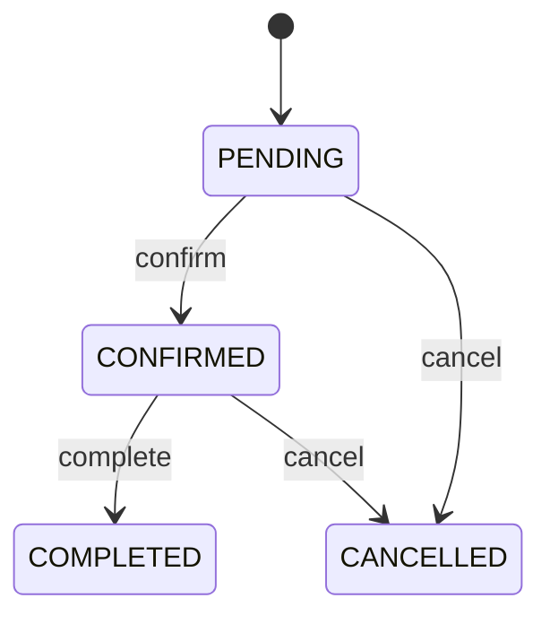

# [SERVICE NAME] — Service Specification

> Template ngắn gọn để review và giao cho coding agent.  
> Điền cụ thể. Mục không áp dụng ghi `N/A` và lý do.

---

## 1. Tổng quan và Boundary

| Thuộc tính | Giá trị |
|---|---|
| **Tên service** | [Appointment Service] |
| **Mục đích** | [Service giải quyết vấn đề gì, 1–3 câu] |
| **Bounded context** | [Ranh giới nghiệp vụ] |
| **Actors/Consumers** | [PATIENT, DOCTOR, service khác...] |
| **Source path** | `services/apps/<service-name>/` |
| **Port / Tech stack** | `[5000]` / [Stack hiện có hoặc đã approve] |

### Chịu trách nhiệm

- [Trách nhiệm 1]
- [Trách nhiệm 2]

### Không chịu trách nhiệm

- [Nghiệp vụ thuộc service khác]
- [Tính năng ngoài scope/future]

### Data ownership

Service là source of truth cho: `[Entity A]`, `[Entity B]`.

| Dữ liệu chỉ tham chiếu | Owner service | Cách tham chiếu |
|---|---|---|
| `patientId` | Patient Service | UUID |
| `[...]` | [...] | [...] |

> Không query trực tiếp database của service khác.

---

## 2. Actors và Authorization

| Actor/Consumer | Hành động | Permission | Resource-level rule |
|---|---|---|---|
| `PATIENT` | [Xem resource] | `resource:read:own` | Chỉ resource của mình |
| `DOCTOR` | [...] | `[...]` | [Ví dụ: được phân công] |
| `[Internal Service]` | [...] | Internal auth/event | [...] |

> Role không mặc định cho quyền trên mọi resource. Ví dụ `DOCTOR` không mặc định được xem mọi bệnh nhân.

---

## 3. Domain và Data Model

### Entities

#### `[EntityName]`

| Field | Type | Required | Default | Constraint | Mô tả |
|---|---|---:|---|---|---|
| `id` | UUID | Yes | Generated | PK | Định danh |
| `status` | Enum | Yes | `PENDING` | Valid enum | Trạng thái |
| `createdAt` | Timestamp | Yes | DB now | Immutable | Thời điểm tạo |
| `updatedAt` | Timestamp | Yes | DB now | — | Thời điểm cập nhật |
| `[...]` | [...] | [...] | [...] | [...] | [...] |

### Relationships, constraints và indexes

| Entity/Table | Loại | Fields | Mục đích/quy tắc |
|---|---|---|---|
| `[A] → [B]` | 1—N | `aId` | [Ownership] |
| `[table]` | UNIQUE | `[businessKey]` | Chặn duplicate/race |
| `[table]` | INDEX | `[status, createdAt]` | Hỗ trợ query |
| `[table]` | CHECK | `[...]` | Bảo vệ invariant |

### State machine

| Current | Action/Event | Next | Điều kiện |
|---|---|---|---|
| `PENDING` | `confirm` | `CONFIRMED` | [...] |
| `CONFIRMED` | `complete` | `COMPLETED` | [...] |
| `CONFIRMED` | `cancel` | `CANCELLED` | [...] |



Invalid transition: trả `409 INVALID_STATE_TRANSITION`, không đổi dữ liệu, không phát success event.

---

## 4. API Contract

- **OpenAPI:** `docs/api-specs/<service-name>.yaml`
- **Base path:** `[/api/...]`
- **Authentication:** [JWT qua Kong / Internal / Public]

### Endpoint summary

| ID | Method | Path | Mục đích | Permission |
|---|---|---|---|---|
| API-001 | GET | `/health` | Health check | Public/Internal |
| API-002 | POST | `/resources` | Tạo resource | `resource:create` |
| API-003 | GET | `/resources/{id}` | Xem resource | `resource:read` |

### Endpoint detail

> Copy block này cho từng endpoint.

#### API-[NNN] — `[METHOD /path]`

- **Mục đích:** [...]
- **Caller/Authorization:** [Actor + permission + ownership rule]
- **Idempotency:** [N/A / business key / `Idempotency-Key`]

**Request**

- Path/query/headers: [Khai báo field, type, required, validation].

```json
{
  "field": "value"
}
```

| Body field | Type | Required | Validation | Mô tả |
|---|---|---:|---|---|
| `field` | string | Yes | 1–100 ký tự | [...] |

**Success — `201 Created`**

```json
{
  "data": {
    "id": "uuid",
    "status": "PENDING"
  }
}
```

**Errors**

| HTTP | Code | Khi nào |
|---:|---|---|
| 400 | `VALIDATION_FAILED` | Input không hợp lệ |
| 401 | `UNAUTHENTICATED` | Chưa xác thực |
| 403 | `FORBIDDEN` | Không có quyền |
| 404 | `RESOURCE_NOT_FOUND` | Không tồn tại |
| 409 | `RESOURCE_CONFLICT` | Duplicate/race |
| 409 | `INVALID_STATE_TRANSITION` | Action không hợp lệ với state hiện tại |
| 422 | `BUSINESS_RULE_VIOLATION` | Vi phạm nghiệp vụ |
| 503 | `DEPENDENCY_UNAVAILABLE` | Dependency bắt buộc lỗi |

**Writes và side effects**

- Local transaction: [...]
- Events sau commit: [...]
- Outbound calls: [...]
- Audit: [...]
- Recovery nếu side effect lỗi: [...]

> Không trả stack trace, SQL error hoặc internal exception cho client.

---

## 5. Business Rules

Mỗi rule có ID để trace sang scenario và test.

| Rule ID | Quy tắc | Enforced by | Error code |
|---|---|---|---|
| BR-001 | [Mô tả cụ thể, không mơ hồ] | Application/DB/Both | `[ERROR_CODE]` |
| BR-002 | [...] | [...] | [...] |

Nếu có tính toán:

| Rule ID | Công thức | Đơn vị | Làm tròn | Boundary |
|---|---|---|---|---|
| BR-CALC-001 | `[formula]` | VND/phút/% | floor/ceil | 0, exact limit, max |

---

## 6. Given–When–Then Scenarios

> Bắt buộc. Mỗi scenario phải đủ cụ thể để chuyển trực tiếp thành test.

### Scenario index

| ID | Loại | Mô tả | Rule/API |
|---|---|---|---|
| SCN-001 | Happy path | [...] | BR-001 / API-002 |
| SCN-002 | Validation | [...] | BR-002 / API-002 |
| SCN-003 | Race | [...] | BR-003 / API-002 |

### Scenario template

#### SCN-[NNN] — `[Tên scenario]`

```gherkin
Given [actor, dữ liệu và trạng thái ban đầu cụ thể]
And [precondition/dependency cụ thể]
When [actor thực hiện một hành động duy nhất]
Then [HTTP status hoặc outcome]
And [database state mong đợi]
And [event/outbound/audit mong đợi]
And [điều không được xảy ra]
```

### Scenarios tối thiểu cho mỗi write use case

| Loại | Given | When | Then bắt buộc |
|---|---|---|---|
| Happy path | Actor có quyền; dữ liệu hợp lệ | Gửi request | 2xx; lưu đúng state; event/audit đúng một lần |
| Validation | Thiếu/sai field | Gửi request | 400; không write; không event |
| Unauthorized | Đúng role nhưng sai owner | Đọc/sửa resource | 403/404; không leak; không đổi data |
| Invalid state | Resource ở terminal/invalid state | Thực hiện action | 409; state giữ nguyên; không success event |
| Duplicate | Business key đã tồn tại | Create lại | 409; không duplicate |
| Idempotent retry | Key K đã tạo resource R | Gửi lại cùng request + K | Trả R; không tạo/event lần hai |
| Race | Chỉ còn một slot/capacity | Hai request đồng thời | Một success; một 409; không overbook |
| Dependency failure | Required dependency timeout | Xử lý request | Retry bounded; 503; không false commit |
| Optional side effect | Core transaction đã commit; notification down | Gửi side effect | Core vẫn success; pending/retry; log an toàn |

---

## 7. Edge Cases

> Giữ các case áp dụng, xóa case không liên quan và bổ sung case đặc thù domain.

| ID | Case | Expected behavior | Result |
|---|---|---|---|
| EDGE-001 | Missing/null/invalid field | Reject, không write | 400 |
| EDGE-002 | Empty/whitespace/too long | Trim hoặc reject theo rule | 400 |
| EDGE-003 | Resource không tồn tại | Reject | 404 |
| EDGE-004 | Đúng role, sai owner | Không leak dữ liệu | 403/404 |
| EDGE-005 | Action lặp ở terminal state | Chốt idempotent hoặc conflict | 200/409 |
| EDGE-006 | Hai create đồng thời | Một success, một conflict | 201 + 409 |
| EDGE-007 | Retry sau timeout | Không duplicate | Same result |
| EDGE-007A | Cùng Idempotency-Key, payload khác | Reject, không đổi dữ liệu | 409 |
| EDGE-008 | Đúng deadline/expiration | Ghi rõ inclusive/exclusive | [...] |
| EDGE-009 | Timezone/date conversion | Không đổi business date | [...] |
| EDGE-010 | Required dependency down | Fail safely, không false success | 503 |
| EDGE-011 | Optional dependency down | Core success; retry side effect | 2xx |
| EDGE-012 | DB commit, response lost | Retry idempotently | Same result |
| EDGE-013 | Duplicate event | Ignore/process idempotently | Ack |
| EDGE-014 | Event sai thứ tự | Không ghi đè state mới hơn | Ignore/log |
| EDGE-015 | Payload quá lớn | Reject | 413 |
| EDGE-016 | Client gửi server-managed field | Reject/ignore theo contract | 400/ignored |
| EDGE-017 | Secret/PII/PHI trong log | Redact/không log | No leak |
| EDGE-DOM-001 | [Case đặc thù domain] | [...] | BR-... / SCN-... |

---

## 8. Integrations và Failure Behavior

### Dependencies

| Dependency | Operation | Required? | Timeout/Retry | Khi lỗi |
|---|---|---:|---|---|
| `[Patient Service]` | `GET /patients/{id}` | Yes | [Timeout, max retry] | 503, no write |
| `[...]` | [...] | [...] | [...] | [...] |

- Không query database service khác.
- Không retry vô hạn; chỉ retry operation an toàn/idempotent.
- Ghi rõ dependency nào được phép fail mà không block business flow.

### Events

| Event | Direction | Producer/Consumer | Trigger/Handling |
|---|---|---|---|
| `domain.resource_created` | Outbound | [Consumer] | Sau local commit |
| `domain.external_changed` | Inbound | [Producer] | [...] |

```json
{
  "eventId": "uuid",
  "eventType": "domain.resource_created",
  "eventVersion": 1,
  "occurredAt": "2026-01-01T00:00:00Z",
  "correlationId": "uuid",
  "data": { "resourceId": "uuid" }
}
```

Event phải có ID/version/correlation ID, không chứa dữ liệu nhạy cảm không cần thiết, và consumer phải xử lý duplicate an toàn.

### Consistency và recovery

- Local transaction: [...]
- Cross-service consistency: [Synchronous / eventual].
- Concurrency control: [Unique constraint / optimistic lock / row lock / N/A].
- Partial failure recovery: [Retry / outbox / reconciliation / N/A].
- Duplicate/out-of-order event behavior: [...].

---

## 9. Security, Audit và NFR

### Security và sensitive data

- Authentication: [Kong JWT / internal auth].
- Resource-level authorization: [...].
- Không tin identity header do client tự gửi.
- DTO allowlist để chống mass assignment.
- Không log password, token, private key, Authorization header hoặc PHI không cần thiết.

| Dữ liệu | Classification | Log policy | Response policy |
|---|---|---|---|
| `[field]` | PII/PHI/Secret | Redact/không log | Chỉ trả khi cần và có quyền |

### Audit

| Event | Khi nào | Metadata |
|---|---|---|
| `[resource.created]` | Resource được tạo | actorId, resourceId, timestamp, requestId |
| `[resource.updated]` | Dữ liệu nhạy cảm đổi | actorId, resourceId, changed fields |

### NFR và configuration

| Concern | Requirement |
|---|---|
| Performance | [P95/throughput nếu có] |
| Availability | [Behavior khi instance/service down] |
| Scalability | [Stateless/stateful; shared state ở đâu] |
| Observability | Logs + requestId; errors, latency, business metrics |

| Variable | Required | Example | Secret? | Mô tả |
|---|---:|---|---:|---|
| `PORT` | No | `5000` | No | Internal port |
| `DATABASE_URL` | Yes | `postgresql://<user>:<password>@<host>/<db>` | Yes | Không ghi credential thật |
| `[...]` | [...] | [...] | [...] | [...] |

- Docker service/database owner: [...].
- Public host port: [Không expose / dev only].
- Health check/migration: [...].
- Công nghệ mới: [N/A hoặc lý do thực sự cần].

---

## 10. Testing và Acceptance

### Traceability

| Rule | Scenario | API/Event | Test case |
|---|---|---|---|
| BR-001 | SCN-001 | API-002 | `[test path/case]` |

### Minimum tests

- [ ] Happy path và input validation.
- [ ] Unauthenticated, unauthorized, wrong owner.
- [ ] Not found và invalid state.
- [ ] Duplicate, idempotent retry, race condition nếu áp dụng.
- [ ] Required/optional dependency failure.
- [ ] Duplicate/stale event nếu có consumer.
- [ ] Sensitive data không bị log/trả sai quyền.
- [ ] DB constraints và API/event contracts.

### Acceptance criteria

#### AC-001 — `[Capability]`

```gherkin
Given [...]
When [...]
Then [...]
```

#### AC-002 — `[Critical edge case]`

```gherkin
Given [...]
When [...]
Then [...]
```

---

## 11. Implementation Plan và Checklist

| Phase | Mục tiêu | Files/Modules | DB/Infrastructure | Verify |
|---|---|---|---|---|
| 1 | Foundation | [module/config/health] | [DB] | [build/unit] |
| 2 | Core domain/API | [...] | [migration] | [unit/integration] |
| 3 | Integrations/security | [...] | [...] | [contract/E2E] |

- [ ] Boundary, ownership, entities và state transitions đúng spec.
- [ ] API request/response/error khớp OpenAPI.
- [ ] Role và resource-level authorization đúng.
- [ ] Idempotency/race/failure recovery đúng spec.
- [ ] Không query database service khác.
- [ ] Events có ID/version; consumer idempotent.
- [ ] Không log/commit secret hoặc sensitive data.
- [ ] Rules trace được sang scenarios và tests.
- [ ] Build/lint/unit/integration/contract/E2E liên quan pass.

---

## 12. Assumptions, Open Questions và Approval

### Assumptions

- [Giả định 1]
- [Giả định 2]

### Open questions

- [Quyết định cần xác nhận; không implement phần bị ảnh hưởng trước khi chốt]

### Out of scope

- [Nghiệp vụ/tính năng không implement]
- [Future improvement]

### Approval

- **Status:** Draft / Approved
- **Approved by / Date:** [...] / [...]
- **Notes:** [...]

> Thay đổi boundary, public API, database schema, event contract hoặc security model phải cập nhật spec trước khi implement.
